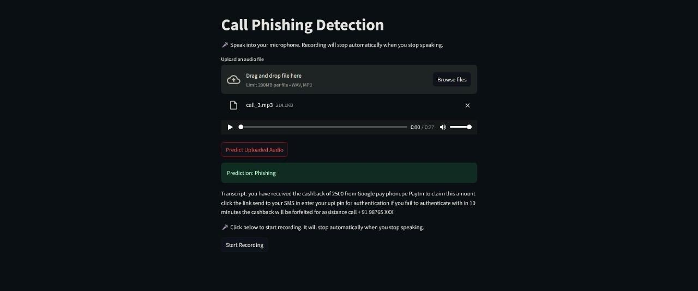

## Scam Call Phishing Detection

## Project Overview
Scam calls are a growing cybersecurity threat, and existing caller identification solutions like Truecaller often fail to detect sophisticated phishing attempts. This project aims to build an AI-powered scam call detection system that analyzes call audio and transcripts to determine whether a call is fraudulent.

## Features
- **Audio Input:** Users can upload or record calls in real time.  
- **Speech-to-Text Conversion:** Converts audio to text using an ASR (Automatic Speech Recognition) model.  
- **Speaker Diarization:** Separates different speakers to isolate the scammer’s speech.  
- **Phishing Detection Model:** Uses an XGBoost machine learning model to classify calls as "Phishing Scam" or "Legitimate."  
- **Real-Time Classification:** Provides instant results for call legitimacy.  
- **API & Web Integration:** Offers an API and web interface for seamless interaction.  
- **Enterprise & Adaptive Security Features:** Continuously improves with new scam patterns and supports enterprise integration.  

## Project Workflow
1. **Audio Input:** User uploads or records a call.  
2. **Speech-to-Text:** The system converts the audio into text.  
3. **Speaker Diarization:** Identifies and isolates scammer voices.  
4. **Text Analysis:** The transcript is analyzed using the trained XGBoost model.  
5. **Classification:** The call is classified as "Phishing Scam" or "Legitimate."  
6. **Result Display:** The result is presented via a web interface or API.  

## Technologies Used
- **Machine Learning:** BiLSTM,XGBoost, Random Forest (for initial models)  
- **Deep Learning:** ASR models for speech-to-text conversion  
- **Web Development:** Flask/FastAPI for backend, React.js for frontend  
- **Cloud Deployment:** AWS/GCP for hosting the application  
- **Data Processing:** NLTK, Scikit-learn, Pandas

  
Team: Bright Brigades
Abjith
Arjun
Asif
Gowsilan
 

